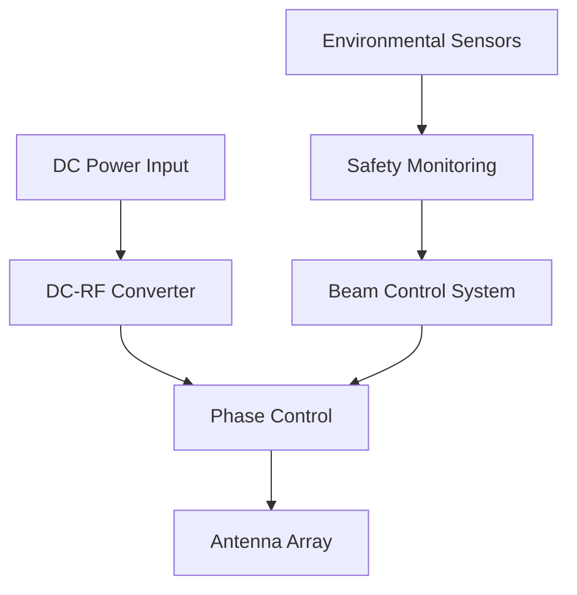
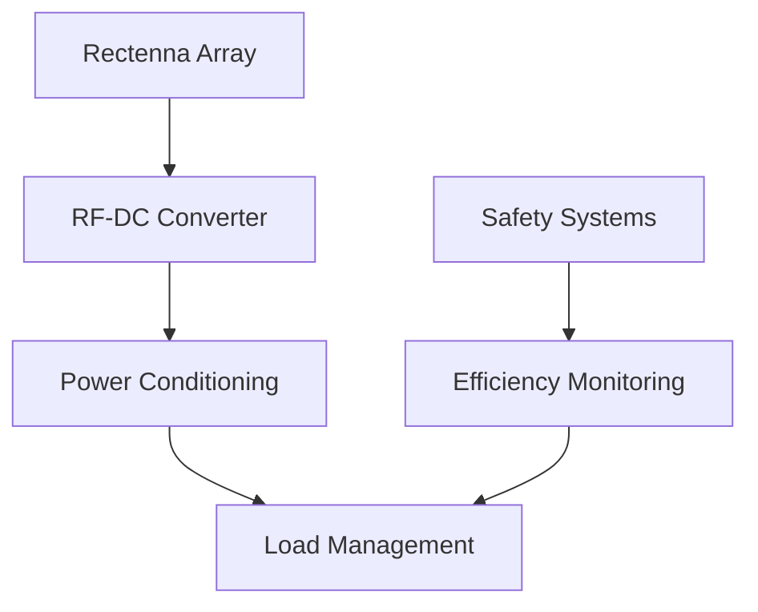
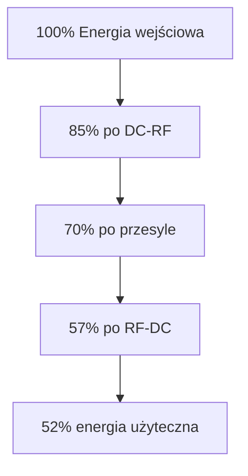

# Technologie bezprzewodowego przesyłu energii w systemie MESH CLUSTER

## 1. Podstawowe technologie przesyłu

### 1.1 RF Rectenna System
```yaml
Specyfikacja:
- Częstotliwość nośna: 24.5 GHz
- Efektywność konwersji: do 82%
- Zasięg efektywny: 20-30m
- Moc przesyłowa: do 100W

Komponenty:
- Nadajnik: Phased Array Antenna
- Odbiornik: Rectenna Array
- Prostowniki: Schottky GaN diody
- Filtr harmonicznych
```

### 1.2 Microwave Power Transfer
```yaml
Parametry:
- Częstotliwość: 5.8 GHz
- Efektywność: do 75%
- Zasięg: do 50m
- Bezpieczna moc: 140W/m²

Technologie:
- Magnetron źródłowy
- Wielokanałowy beam forming
- Adaptacyjne sterowanie wiązką
- System monitorowania warunków
```

## 2. Architektura systemu

### 2.1 Nadajnik energii


### 2.2 Odbiornik energii


## 3. Kluczowe komponenty

### 3.1 Antena nadawcza
```yaml
Specyfikacja:
- Typ: Phased Array
- Elementy: 16x16 array
- Kierunkowość: 30dBi
- Szerokość wiązki: 3°
- Polaryzacja: Dual-linear

Materiały:
- Substrat: Rogers RO4350B
- Elementy radiacyjne: miedź
- Ekranowanie: aluminium
```

### 3.2 System beam formingu
```python
class BeamFormingController:
    def __init__(self):
        self.array_size = (16, 16)
        self.phase_states = 64  # 6-bit phase control
        self.power_states = 32  # 5-bit amplitude control
        
    def calculate_beam_pattern(self, target_position):
        """
        Oblicza wzorzec wiązki dla zadanej pozycji
        """
        phases = np.zeros(self.array_size)
        amplitudes = np.ones(self.array_size)
        
        for i in range(self.array_size[0]):
            for j in range(self.array_size[1]):
                phases[i,j] = self.calculate_phase(i, j, target_position)
                amplitudes[i,j] = self.optimize_amplitude(i, j)
                
        return phases, amplitudes
        
    def adjust_for_efficiency(self, feedback_data):
        """
        Dostosowuje parametry wiązki na podstawie danych zwrotnych
        """
        current_efficiency = feedback_data['efficiency']
        power_received = feedback_data['power']
        
        if current_efficiency < target_efficiency:
            self.optimize_beam_parameters()
```

## 4. Systemy bezpieczeństwa

### 4.1 Monitoring aktywny
```yaml
Parametry monitorowane:
- Gęstość mocy wiązki
- Temperatura elementów
- Obecność obiektów
- Stabilność wiązki
- Efektywność przesyłu

Systemy bezpieczeństwa:
- Automatyczne wyłączanie
- Adaptacyjna regulacja mocy
- Detekcja przeszkód
- Termiczna ochrona
```

### 4.2 Algorytmy bezpieczeństwa
```python
class SafetyController:
    def check_safety_parameters(self, beam_data):
        """
        Sprawdza parametry bezpieczeństwa wiązki
        """
        if beam_data.power_density > MAX_SAFE_DENSITY:
            self.reduce_power()
            
        if beam_data.temperature > MAX_TEMP:
            self.emergency_shutdown()
            
        if self.detect_obstacles():
            self.redirect_beam()
```

## 5. Efektywność systemu

### 5.1 Straty energii
```yaml
Źródła strat:
- Konwersja DC-RF: 15%
- Straty w powietrzu: 5-20%
- Konwersja RF-DC: 18%
- Straty w prostowniku: 8%

Optymalizacja:
- Adaptacyjne sterowanie mocą
- Dynamiczne śledzenie celu
- Kompensacja warunków atmosferycznych
```

### 5.2 Wykres efektywności


## 6. Wyzwania techniczne

### 6.1 Główne problemy
1. Efektywność przy większych odległościach
2. Wpływ warunków atmosferycznych
3. Bezpieczeństwo biologiczne
4. Stabilność wiązki
5. Koszty komponentów

### 6.2 Rozwiązania
```yaml
Proponowane rozwiązania:
- Adaptacyjne algorytmy sterowania
- Zaawansowane materiały dla anten
- Systemy wielościeżkowe
- Dynamiczna optymalizacja mocy
- Redundantne systemy bezpieczeństwa
```

## 7. Przyszłe kierunki rozwoju

### 7.1 Planowane ulepszenia
1. Zwiększenie efektywności do 85%
2. Rozszerzenie zasięgu do 100m
3. Redukcja kosztów o 40%
4. Miniaturyzacja komponentów
5. Integracja z AI do optymalizacji

### 7.2 Nowe technologie
- GaN HEMT prostowniki
- Metamateriały dla anten
- Kwantowe sensory mocy
- Adaptacyjne powierzchnie antenowe

