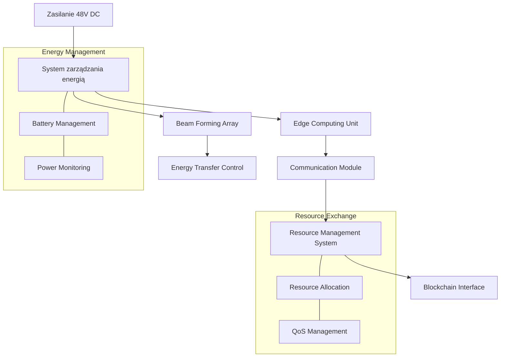

# clustermesh
energy + computing + communication


# Specyfikacja techniczna: EdgeResourceHub

## 1. ARCHITEKTURA SPRZĘTOWA

### Moduł komunikacyjny:
- Główny chip: Qualcomm QCX216 LTE/5G IoT
- Obsługa pasm: LTE Band 1/3/7/8/20/28, 5G Sub-6 n78
- MIMO 4x4 dla zwiększenia zasięgu
- Zintegrowany GPS/GLONASS dla geolokalizacji
- Zasięg efektywny: do 5km w terenie otwartym
- Przepustowość: do 1Gbps (5G) / 150Mbps (LTE)

### Edge Computing:
- Procesor: ARM Cortex-A78AE (8 rdzeni)
- RAM: 8GB LPDDR5
- Storage: 128GB eMMC + slot microSD
- GPU: ARM Mali-G78 dla obliczeń AI
- TPU: Edge TPU dla inferecji AI (4 TOPS)
- TDP: max 15W

### Zasilanie i zarządzanie energią:
- Zasilacz główny: 48V DC
- Konwerter DC-DC z efektywnością 95%
- System zarządzania baterią (Li-Ion 48V 20Ah)
- Układy zabezpieczające i monitorujące

### Moduł Beam Forming:
- Antena fazowana 8x8 MIMO
- Częstotliwość pracy: 2.4GHz / 5.8GHz
- Moc wyjściowa: regulowana 0-100W
- Efektywność transferu energii: do 75% @ 20m
- Aktywne chłodzenie z kontrolą temperatury

## 2. PROTOKOŁY KOMUNIKACYJNE

### Warstwa fizyczna:
```
Protokół: CustomResourceMesh v1.0
- Ramka podstawowa:
  [PREAMBUŁA(4B)][TYP_ZASOBU(1B)][PRIORYTET(1B)][PAYLOAD(1-1024B)][CRC32(4B)]
- Typy zasobów:
  0x01: Energia
  0x02: Moc obliczeniowa
  0x03: Storage
  0x04: Bandwidth
```

### Warstwa transportowa:
```
ResourceExchange Protocol (REP):
- Header:
  struct REPHeader {
    uint32_t source_id;
    uint32_t dest_id;
    uint8_t resource_type;
    uint8_t qos_level;
    uint16_t payload_length;
    uint32_t timestamp;
  }
```

### Warstwa aplikacji:
```
Resource API:
POST /resource/offer
{
  "type": "ENERGY",
  "amount": 1000,
  "unit": "Wh",
  "price": 0.15,
  "duration": 3600,
  "location": {
    "lat": 52.2297,
    "lon": 21.0122
  }
}
```

## 3. SCHEMAT BLOKOWY URZĄDZENIA



## 4. SPECYFIKACJA OBUDOWY I CHŁODZENIA

### Obudowa:
- Wymiary: 300x200x150mm
- Materiał: Stop aluminium z radiatorami
- Klasa szczelności: IP67
- Montaż: Uchwyt uniwersalny dla masztów 30-60mm

### System chłodzenia:
- Aktywne chłodzenie cieczą dla modułu Beam Forming
- Heat pipes dla modułu obliczeniowego
- Wentylatory: 2x 120mm, sterowane PWM
- Czujniki temperatury: 8 punktów pomiarowych

## 5. INTERFEJSY I ZŁĄCZA

### Fizyczne:
- Power input: złącze przemysłowe M12
- Ethernet: 2x RJ45 (1Gbps)
- Fiber: SFP+ do 10Gbps
- USB: 2x USB 3.0 Type-C
- GPIO: 24-pin złącze rozszerzeń

### Bezprzewodowe:
- WiFi 6E
- Bluetooth 5.2
- LoRaWAN
- NB-IoT

## 6. OPROGRAMOWANIE

### System operacyjny:
```python
# Custom Linux distribution
KERNEL_VERSION = "5.15-rt"
SECURITY_FEATURES = [
    "Secure Boot",
    "TPM 2.0",
    "AppArmor profiles",
    "Resource isolation"
]
```

### Resource Management:
```python
class ResourceManager:
    def allocate_resource(self, request):
        if self.verify_availability(request):
            contract = self.create_smart_contract(request)
            return self.initiate_transfer(contract)
            
    def monitor_transfer(self, transfer_id):
        metrics = self.collect_metrics(transfer_id)
        self.adjust_parameters(metrics)
```

## 7. BEZPIECZEŃSTWO

### Mechanizmy zabezpieczeń:
- Secure Element dla kluczy kryptograficznych
- Hardware Security Module (HSM)
- Encrypted Storage
- Secure Boot z TPM 2.0
- Real-time intrusion detection

## 8. CERTYFIKACJA I STANDARDY

### Wymagane certyfikaty:
- CE (Europa)
- FCC (USA)
- IC (Kanada)
- ETSI EN 301 489-1
- IEC 61000-4-2

